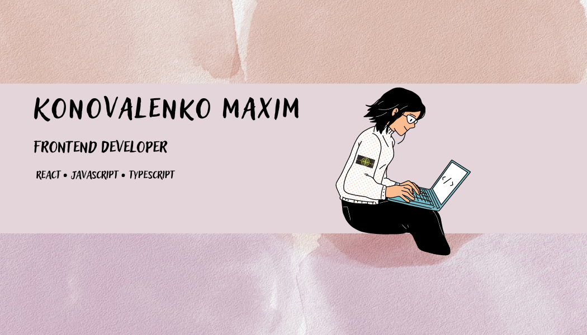

___

- 💼 I work at frontend.
- 🎓 I am a student at ITMO University.
- 👨‍💻 I started learning web programming in 2021.
- 🔥 I have a small goal to win the hackathon.
- 🖤 My personal hobbies include webdev, football and taekwondo.
- ⚽ I am a fan of FC Barcelona.
- ✨ I constantly seek for inspiration.
- 🌈 I don't know what stagnation is.

## 👨‍💻 About me

[resume](https://drive.google.com/drive/folders/1uEhyLm4IL6n2mYMZPU_3TaaPZH2s9t-a)
# Dillinger

<!--  -->
